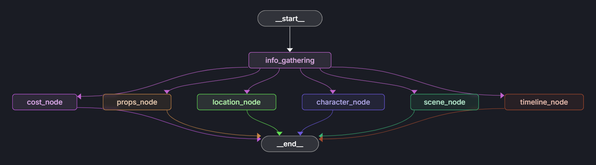

## Overview
This project uses multiple specialized AI agents working in parallel to breakdown a script into useful information for different department.

## Architecture
This system consist of 7 agents:
  1. **info_gathering_agent**: Extract necessary information from scripts
  2. **character_analysis_agent**: Analyze characters involve
  3. **cost_analysis_agent**: Analyze production cost
  4. **location_analysis_agent**: Analyze environment for the shooting
  5. **props_extractin_agent**: Analyze props needed
  6. **scene_extraction_agent**: Breakdown and analyze each scene
  7. **timeline_agent**: Analyze timeline and schedule plan

## Stacks
  * **Pydantic AI**: Building an agent
  * **Langgraph**: Orchestrating agents workflow.(Parallel execution)

## LLM Model
* .env
```python
api_key=<your_api_key>
model_choice=<llm_model>
```
* utils.py
  * model configuration:
    * os.getenv('MODEL_CHOICE', 'gemini-2.0-flash'): Gets the model name from environment variables, defaults to 'gemini-2.0-flash'
    * os.getenv('GEMINI_KEY'): Gets the API key from environment variables
  * provider and model initialization
    * Creates a provider instance with your API key
    * Creates and returns a GeminiModel instance using the provider
```python
from pydantic_ai.models.gemini import GeminiModel
from pydantic_ai.providers.google_gla import GoogleGLAProvider
from dotenv import load_dotenv
import os

load_dotenv()

def get_model():
    model_name = os.getenv('MODEL_CHOICE', 'gemini-2.0-flash')
    api_key = os.getenv('GEMINI_KEY')
    
    # Initialize the provider with the API key
    provider = GoogleGLAProvider(api_key=api_key)
    
    # Create GeminiModel with the provider
    return GeminiModel(model_name, provider=provider)
```
```python
# Alternative utils.py for multi provider
from pydantic_ai.models.gemini import GeminiModel
from pydantic_ai.models.openai import OpenAIModel
from pydantic_ai.models.ollama import OllamaModel
from pydantic_ai.providers.google_gla import GoogleGLAProvider
from pydantic_ai.providers.openai import OpenAIProvider
from pydantic_ai.providers.ollama import OllamaProvider
from dotenv import load_dotenv
import os

load_dotenv()

def get_model(provider_type='gemini'):
    """
    Get a model based on the provider type
    
    Args:
        provider_type (str): 'gemini', 'openai', or 'ollama'
    """
    
    if provider_type == 'gemini':
        model_name = os.getenv('GEMINI_MODEL', 'gemini-2.0-flash')
        api_key = os.getenv('GEMINI_KEY')
        provider = GoogleGLAProvider(api_key=api_key)
        return GeminiModel(model_name, provider=provider)
    
    elif provider_type == 'openai':
        model_name = os.getenv('OPENAI_MODEL', 'gpt-4')
        api_key = os.getenv('OPENAI_API_KEY')
        provider = OpenAIProvider(api_key=api_key)
        return OpenAIModel(model_name, provider=provider)
    
    elif provider_type == 'ollama':
        model_name = os.getenv('OLLAMA_MODEL', 'llama2')
        base_url = os.getenv('OLLAMA_BASE_URL', 'http://localhost:11434')
        provider = OllamaProvider(base_url=base_url)
        return OllamaModel(model_name, provider=provider)
    
    else:
        raise ValueError(f"Unsupported provider type: {provider_type}")

# Usage examples
gemini_model = get_model('gemini')
openai_model = get_model('openai')
ollama_model = get_model('ollama')
```
## AI Agent

* ### Dependencies/Context
  * Purpose:
    * Provides contextual information that the AI agent can access during execution.
  * Use Cases:
    * Authentication data, user preferences, session info, environmental variables, or any background information the AI needs.
  * Key Points:
    * Uses @dataclass for simple data structure
    * Contains metadata about the analysis (timestamp)
    * Automatically sets timestamp if not provided
    * Passed to the agent via deps_type=ScriptContext
    * The agent can use this context to make informed decisions
```python
@dataclass
class ScriptContext:
    """Simple context for script analysis"""
    analysis_timestamp: datetime = None
    
    def __post_init__(self):
        if self.analysis_timestamp is None:
            self.analysis_timestamp = datetime.now()
```
* ### State/Output
  * Purpose:
    * Defines the structured output format that the AI agent must return.
  * Benefits:
    * Ensures consistent, typed output
    * prevents hallucination in structure
    * enables easy data processing downstream.
  * Key Points:
    * Uses Pydantic BaseModel for type validation
    * Each field has a clear description for the AI
    * Enforces data types (List[str], int, etc.)
    * Automatically validates the AI's response
If AI returns invalid format, Pydantic will raise validation errors
```python
class RawScriptData(BaseModel):
    """Simplified raw data extracted from script"""
    characters: List[str] = Field(description='List of character names found in script')
    locations: List[str] = Field(description='List of locations/scene headers found')
    dialogue_lines: List[str] = Field(description='Sample dialogue lines')
    # ... more fields
```
* ### Prompt
  * Purpose:
    * Provides instructions and context to guide the AI's behavior.
  * Best Practices:
    * Be specific, provide examples, set clear boundaries, match your output schema.
  * Key Points:
    * Sets the AI's role ("script analysis expert")
    * Gives specific, numbered instructions
    * Provides clear expectations ("thorough but concise")
    * Matches the output structure defined in RawScriptData
    * Can include examples, constraints, or formatting guidelines
```python
system_prompt = """
You are a script analysis expert. Extract key information from the provided script.

Extract and return:
1. Character names (anyone who speaks)
2. Locations (INT./EXT. scene headers)
3. A few sample dialogue lines
4. A few sample action lines
5. Primary language (English/Malay)
6. Basic script statistics

Be thorough but concise. Focus on accuracy over completeness.
"""
```
* ### Agent
  * Purpose:
    * The main AI agent that combines model, prompt, input/output types, and configuration.
  * Use Cases:
    * Orchestrates the entire AI interaction, handles validation, manages retries, and ensures type safety.
  * Key Points:
    * model: The underlying LLM (GPT, Claude, etc.)
    * output_type: Pydantic model for structured output
    * system_prompt: Instructions for the AI
    * deps_type: Type of context/dependencies
    * retries: How many times to retry on failure
```python
info_gathering_agent = Agent(
    model,                    # The LLM to use
    output_type=RawScriptData,  # Expected output format
    system_prompt=system_prompt, # Instructions
    deps_type=ScriptContext,    # Context type
    retries=2                   # Retry failed attempts
)
```
* ### Function
  * Purpose:
    * The main interface that orchestrates the entire process.
  * Flow:
    * Prepare input and context
    * Run the agent with the data
    * Get structured output
    * Handle any errors gracefully
    * Return typed result
  * Key Points:
    * Input Processing: Limits content to avoid token limits
    * Context Creation: Creates ScriptContext instance
    * Agent Execution: Calls agent.run() with input and context
    * Error Handling: Catches failures and provides fallback
    * Output Return: Returns validated RawScriptData
```python
async def extract_script_data(script_content: str) -> RawScriptData:
    """Extract raw data from script content"""
    context = ScriptContext()
    
    try:
        # Limit script content to avoid token limits
        limited_content = script_content[:8000] if len(script_content) > 8000 else script_content
        
        result = await info_gathering_agent.run(limited_content, deps=context)
        return result.output
        
    except Exception as e:
        print(f"Pydantic AI extraction failed: {e}")
        # Fallback to manual extraction
        return _manual_extract_script_data(script_content)
```
* ### Tool
  * Purpose
    * The tools are designed to work with the existing RawScriptData output and can provide additional context for more comprehensive script analysis.
```python
# Create tool.(Not included in the code)
def analyze_character_frequency(script_content: str) -> Dict[str, Any]:
    """
    Analyze character dialogue frequency and speaking patterns.
    
    Args:
        script_content: The full script text to analyze
        
    Returns:
        Dictionary with character statistics
    """
    lines = script_content.split('\n')
    character_stats = {}
    current_character = None
    
    for line in lines:
        line = line.strip()
        
        # Detect character name (all caps, not scene header)
        if (line.isupper() and 
            len(line.split()) <= 3 and 
            not line.startswith(('INT.', 'EXT.', 'FADE', 'CUT', 'DISSOLVE'))):
            
            clean_name = re.sub(r'\s*\([^)]*\)', '', line).strip()
            if clean_name and len(clean_name) > 1:
                current_character = clean_name
                if current_character not in character_stats:
                    character_stats[current_character] = {
                        'dialogue_count': 0,
                        'total_words': 0,
                        'avg_line_length': 0
                    }
        
        # Count dialogue for current character
        elif current_character and line and not line.isupper():
            character_stats[current_character]['dialogue_count'] += 1
            words = len(line.split())
            character_stats[current_character]['total_words'] += words
            
            # Calculate average line length
            char_data = character_stats[current_character]
            char_data['avg_line_length'] = char_data['total_words'] / char_data['dialogue_count']
    
    # Sort by dialogue frequency
    sorted_characters = dict(sorted(character_stats.items(), 
                                  key=lambda x: x[1]['dialogue_count'], 
                                  reverse=True))
    
    return {
        'character_stats': sorted_characters,
        'total_characters': len(character_stats),
        'most_active_character': list(sorted_characters.keys())[0] if sorted_characters else None
    }

# Register tools with the agent
character_analysis_tool = Tool(analyze_character_frequency, takes_ctx=False)

# Updated agent with tools
info_gathering_agent = Agent(
    model,
    output_type=RawScriptData,
    system_prompt=system_prompt,
    deps_type=ScriptContext,
    tools=[character_analysis_tool],
    retries=2
)
```
## Graph

### Reducers
* Purpose:
  * Handle how state updates are combined when multiple nodes run concurrently and try to update the same field.
* Common Patterns:
  * Merge dictionaries: Combine key-value pairs
  * Merge lists: Concatenate arrays
  * Merge booleans: Use OR/AND logic
  * Take latest: Use most recent non-None value
* Key Points:
  * Without reducers: If two nodes update the same field, one overwrites the other
  * With reducers: Updates are intelligently merged using custom logic
  * Used with Annotated: Annotated[Dict[str, Any], merge_metadata]
```python
def merge_metadata(left: Dict[str, Any], right: Dict[str, Any]) -> Dict[str, Any]:
    """Merge metadata dictionaries"""
    if not left:
        return right
    if not right:
        return left
    return {**left, **right}

def merge_analyses_complete(left: Dict[str, bool], right: Dict[str, bool]) -> Dict[str, bool]:
    """Merge analyses completion status"""
    if not left:
        return right
    if not right:
        return left
    return {**left, **right}
```
### States/Outputs
* Purpose:
  * Central state that flows through the entire workflow, accumulating results from each node.
* State Categories:
  * Input Data: Set once at start (script_content)
  * Intermediate Results: Set by specific nodes (raw_data)
  * Final Results: Set by analysis nodes (cost_analysis, etc.)
  * Metadata: Tracking info with reducers (processing_metadata)
* Key Points:
  * Shared State: All nodes read from and write to this state
  * Immutable Updates: Each node returns a partial update dict
  * Type Safety: Pydantic validation ensures data integrity
  * Concurrent Safety: Reducers handle parallel updates
```python
class ScriptAnalysisState(BaseModel):
    """State for script analysis workflow"""
    # Input - set once
    script_content: str = Field(description="Original script content")
    
    # Workflow tracking - with reducers for concurrent updates
    current_agent: Annotated[Optional[str], merge_strings] = Field(default=None)
    task_complete: Annotated[bool, merge_bools] = Field(default=False)
    
    # Phase 1: Raw data - set by single node
    raw_data: Optional[RawScriptData] = Field(default=None)
    extraction_complete: bool = Field(default=False)
    
    # Phase 2: Analysis results - each set by different nodes
    cost_analysis: Optional[CostBreakdown] = Field(default=None)
    props_analysis: Optional[PropsBreakdown] = Field(default=None)
    location_analysis: Optional[LocationBreakdown] = Field(default=None)
    # ... more analyses
    
    # Tracking with reducers
    analyses_complete: Annotated[Dict[str, bool], merge_analyses_complete] = Field(...)
    processing_metadata: Annotated[Dict[str, Any], merge_metadata] = Field(...)
    errors: Annotated[List[str], merge_errors] = Field(...)
```
### Dependencies
* Purpose:
  * Provide configuration and external resources that nodes might need.
* Notes:
  * Unlike state (which changes), dependencies provide stable context and configuration.
  * API credentials
  * Database connections
  * Global configuration
  * External service clients
* Key Points:
  * Configuration: Timeouts, retry counts, API keys
  * External Resources: Database connections, file paths
  * Shared Context: Information all nodes need access to
  * Immutable: Dependencies don't change during workflow execution
```python
@dataclass
class ScriptAnalysisDeps:
    """Dependencies for script analysis agents"""
    script_content: str
    max_retries: int = 3
    timeout_seconds: int = 300
```
### Nodes
* Purpose:
  * Individual processing units that perform specific tasks in the workflow.
* Responsibilities:
  * Validate Input: Check if required data is available
  * Process Data: Call agents, perform calculations
  * Handle Errors: Catch and report failures
  * Return Updates: Only return fields this node should modify
* Key Points:
  * Input: Receives current state
  * Processing: Performs specific analysis/task
  * Output: Returns partial state update (not full state)
  * Async: Can run concurrently with other nodes
  * Error Handling: Gracefully handle failures
```python
async def run_cost_analysis(state: ScriptAnalysisState) -> Dict[str, Any]:
    """Run cost analysis."""
    print("💰 Running cost analysis...")
    
    if not state.raw_data:
        error_msg = "No raw data available for cost analysis"
        return {"errors": [error_msg]}
    
    try:
        result = await safe_call_agent(analyze_costs, state.raw_data)
        actual_result = extract_result(result)
        
        return {
            "current_agent": "cost_analysis",
            "cost_analysis": actual_result,
            "analyses_complete": {"cost": True}
        }
        
    except Exception as e:
        error_msg = f"Error in cost analysis: {str(e)}"
        return {
            "current_agent": "cost_analysis",
            "errors": [error_msg]
        }
```
### Graph
* Purpose:
  * Defines the execution flow and dependencies between nodes.
* Benefits:
  * Parallelization: Independent analyses run concurrently
  * Dependency Management: Ensures info_gathering completes before analyses
  * Error Isolation: One node failure doesn't stop others
  * Scalability: Easy to add new analysis nodes
* Key Points:
  * StateGraph: Container that manages state flow
  * Nodes: Processing units added to the graph
  * Edges: Define execution order and dependencies
  * START/END: Special nodes marking workflow boundaries
```python
def create_script_analysis_workflow():
    """Create and return the script analysis workflow."""
    workflow = StateGraph(ScriptAnalysisState)
    
    # Add nodes
    workflow.add_node("info_gathering", run_info_gathering)
    workflow.add_node("cost_node", run_cost_analysis)
    workflow.add_node("props_node", run_props_analysis)
    # ... more nodes
    
    # Define execution flow
    workflow.add_edge(START, "info_gathering")
    workflow.add_edge("info_gathering", "cost_node")
    workflow.add_edge("info_gathering", "props_node")
    workflow.add_edge("info_gathering", "location_node")
    # ... more parallel edges
    workflow.add_edge("cost_node", END)
    workflow.add_edge("props_node", END)
    # ... all nodes to END
    
    return workflow.compile()
```
