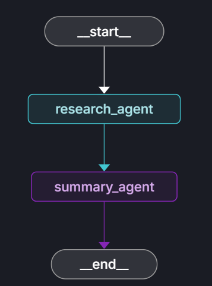

## Serial Agent Flow
A demonstration of serial agent architecture using Pydantic-AI to build each agent and Langgraph to orchestrate the workflow.



### Agents

Fundamental structure to build an agent consist of 3 features:
- **State** : structure that helps agents pass information to each other in a clean, organized way.
- **Agent** : an AI where we can pass specific model,prompt,state,dependencies and etc.
- **Tool** : a function that allowed agent to use external systems to perform specialized tasks.

### Graph

Fundamental structure to build graph
- **State** : structure that helps agents pass information to each other in a clean, organized way.
- **Router** : to define the logic of the flow before/after each task.
- **Node** : a "node" is a function that represents a single step or action in AI workflow.
- **Graph** : orchestrate the flow from 1 node to the next.

### How to start from scratch

1. Create virtual environment and activate.
**Windows**
```bash
python -m venv <folder_name>
.\<folder_name>\Scripts\activate
```
**macOS/Linux**
```bash
python3 -m venv <folder_name>
source <folder_name>/bin/activate
```
2. Install dependencies.
```bash
pip install pydantic pydantic-ai langgraph
```
3. Create `.env` using `.env_example` template.
4. Create `utils.py` to define model for agents(in this example we are using gemini).
5. Create agents folder for our `research_agent.py` and `summary_agent.py`
6. Create `agents_graph.py` for orchestration
7. Create `langgraph.json` to set the location of our `agents_graph.py` location
8. Test the Agentic AI
```bash
langgraph dev
```
